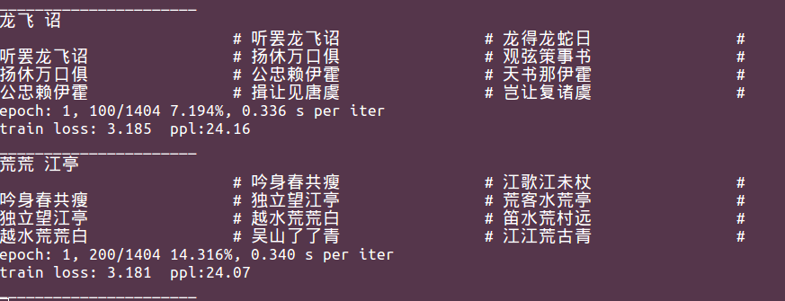
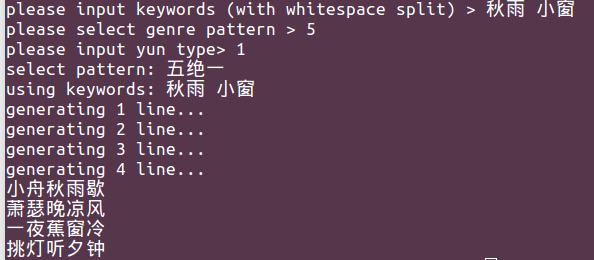

# WMPoetry
Code for *Chinese Poetry Generation with a Working Memory Model*.
## 0. Rights
All rights reserved.
## 1. Requirements
* python == v2.7
* TensorFlow == v1.4

## 2. Data Preparations
To train the model and generate poems, we provide some necessary data files as follows:

* A rhyme dictionary. We use *cilinzhengyun* (《词林正韵》) instead of pingshuiyun (《平水韵》).
* The stop words files.
* A tf-idf file, which contains pre-calculated tf-idf values.
* The Ping (level) tone dictionary and Ze (oblique) tone dictionary.
* A human-checked high-quality words file.
* A genre pattern file for quatrains.

We also provide a small corpus with 25,000 Chinese quatrains for testing this code.

All these data files are avaliable in：

https://drive.google.com/drive/folders/1YrIC9hUAZ1LRceRPXnpsdtorjIrvJeQy?usp=sharing

You can also use your own data.

## 3. Preprocessing

### 3.1. Word Segmentation

At first, one needs to move all the downloaded files to WMPoetry/preprocess/data/, then to segment the corpus and save the poems with whitespace separating words and with '|' separating sentences. The segmented corpus file should look like:


In this file, each line is a poem. The provided small corpus has been segmented with our own poetry segmentation tool.

### 3.2. Keywords Extraction and Genre Pattern Building

We provide a script to extract keywords and build genre pattern, only for Chinese quatrains. For other genres, such as lyrics and Song iambics, the scripts will be uploaded as soon as possible.

Put the segmented corpus file (e.g., corpus.txt) into WMPoetry/preprocess/, then in WMPoetry/preprocess/, run:
```
python preprocess.py --inp corpus.txt --trout train.txt --vout valid.txt --tout test.txt --vratio 0.05 --tratio 0.05
```
We use 5% of the data for valiation and 5% for testing.

NOTE: By running preprocess.py, one will also get a file, DuplicateCheckLib.txt, which contains all sentences in training set. When generating poems, we will remove the generated candidates which are already in DuplicateCheckLib.txt.

### 3.3. Binarization

If there isn't pre-trained word embedding or corresponding dictionary files, please first build the dictionary in WMPoetry/preprocess/, by:
```
python build_dic.py -i train.txt
```
and one can get the dictionary file and inverting dictionary file, vocab.pkl and ivocab.pkl.

Then, binarize training data and validation data:
```
 python binarize.py -i train.txt -b train.pkl -d vocab.pkl
 python binarize.py -i valid.txt -b valid.pkl -d vocab.pkl
```

### 3.4. Before Training and Generation

Before training and generation, please:
1. move test.txt to WMPoetry/wm;
2. move train.pkl, valid.pkl, vocab.pkl and ivocab.pkl to WMPoetry/wm/train/;
3. move pingsheng.txt, zesheng.txt and cilinList.txt to WMPoetry/wm/other/;
4. move DuplicateCheckLib.txt and GenrePatterns.txt to WMPoetry/wm/other/.

## 4. Training
In WMPoetry/wm, edit config.py to set the hyper-parameters (such as hidden size, embedding size) and the data path. By default, all data files are saved in WMPoetry/wm/data, and the model files (checkpoints) are saved in WMPoetry/wm/model/. Then run:
```
python train.py
```
Some training information is outputed as:



One can also check the saved training information in trainlog.txt.

## 5. Generation
We provide two interfaces of poetry generation.

The first one is an interactive interface. In WMPoetry/wm, run:
```
python generate --type one --bsize 20
```

Then one can input keywords, select genre pattern and rhyme:



One can also set a specific checkpoint as:
```
python generate.py --type one --bsize 20 --model model/poem.ckpt_4-5616
```

The second interface is to generate poems according to the whole testing set:
```
python generate.py --type file --bsize 20 --inp test.txt --out output.txt
```
## 6. System
This work has been integrated into THUNL automatic poetry generation system, ** Jiuge (九歌)**, which is available via https://jiuge.thunlp.cn. 

<div align=center></div>

## 7. Citation
Chinese Poetry Generation with a Working Memory Model. Xiaoyuan Yi, Maosong Sun, Ruoyu Li, Zonghan Yang. In Proceedings of IJCAI 2018.
## 8. Contact
If you have any questions, suggestions and bug reports, please email yi-xy16@mails.tsinghua.edu.cn or mtmoonyi@gmail.com.